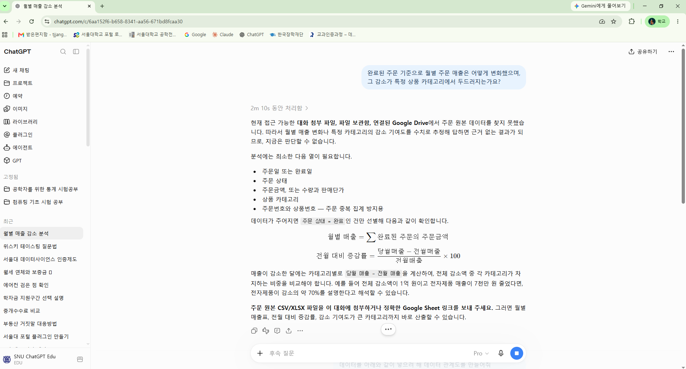
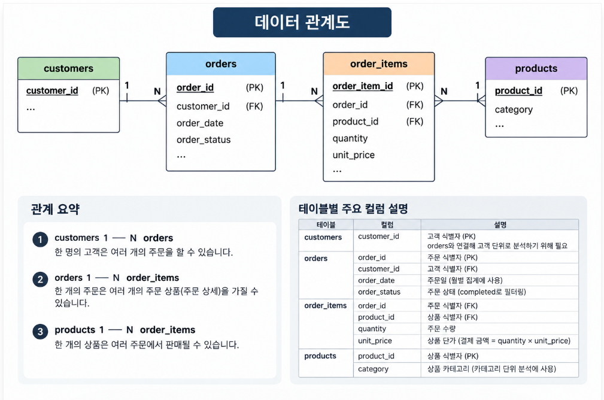
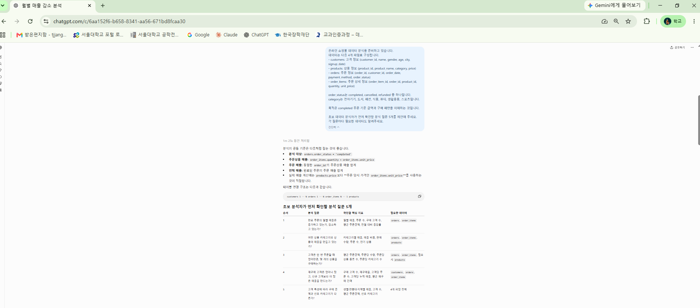
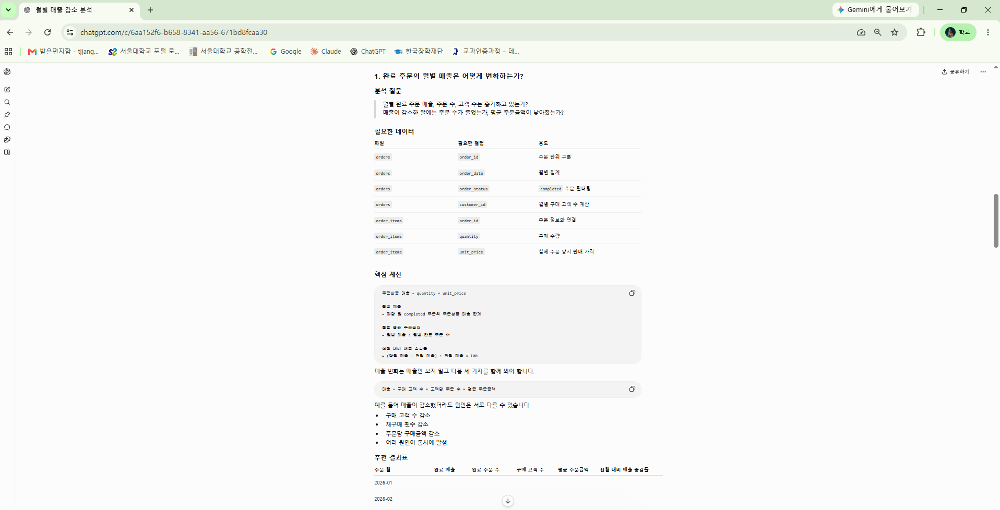
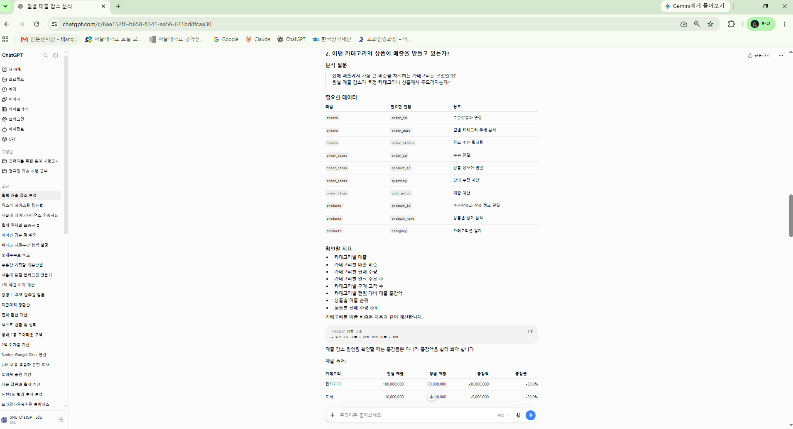
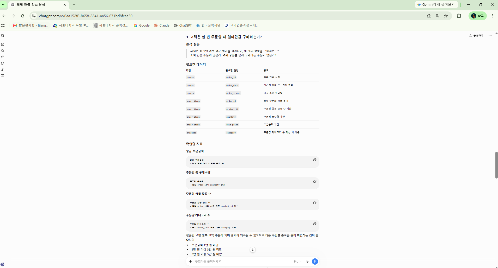
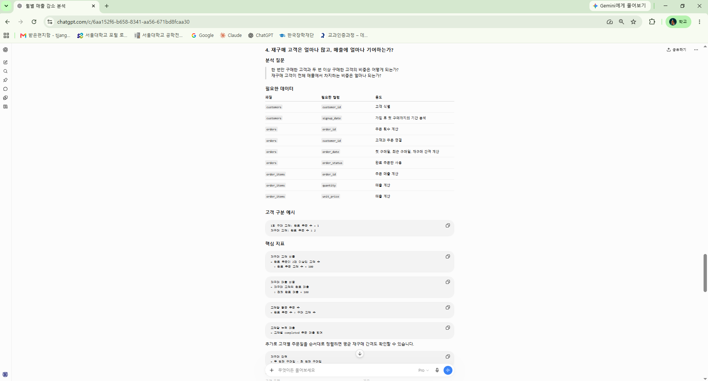
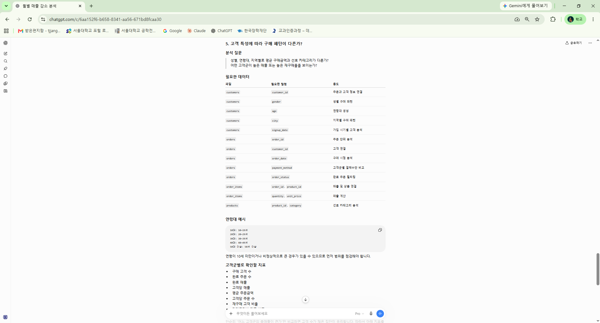
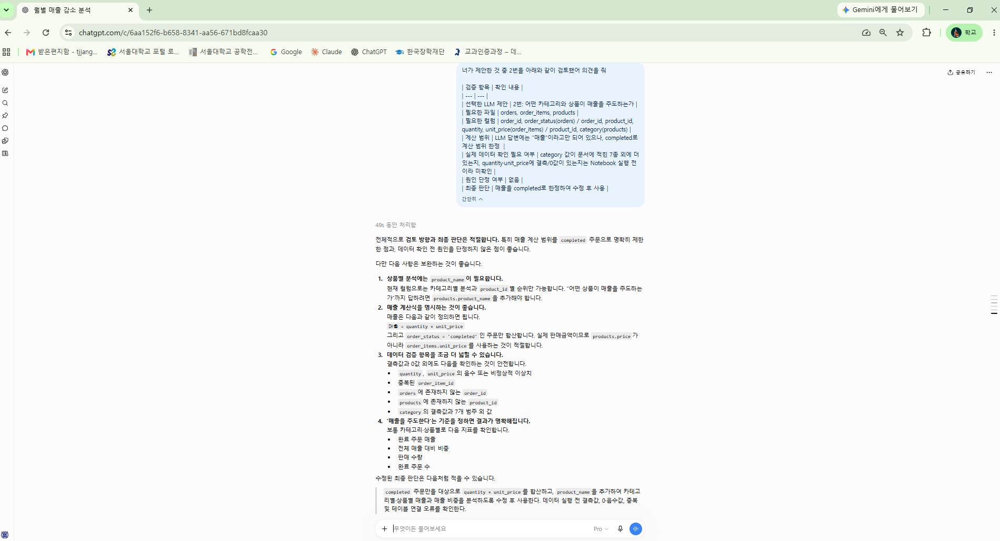
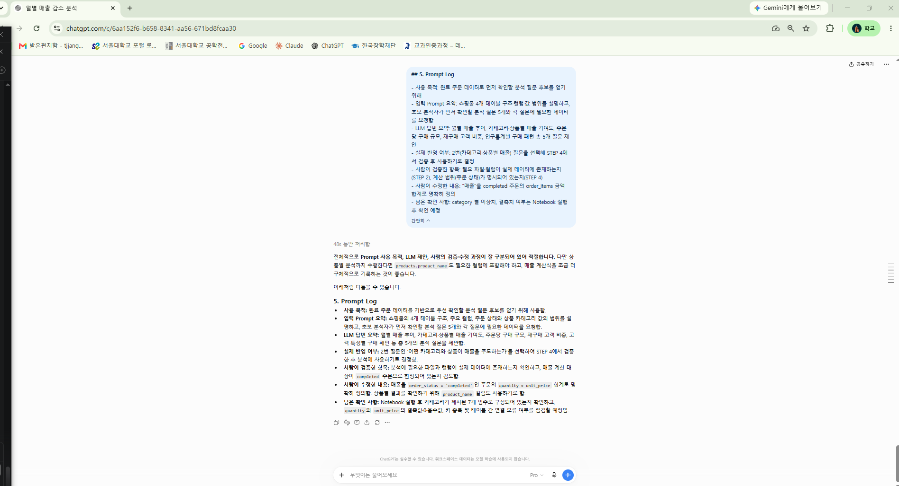

# Chapter 01 제출 답안. AI와 함께하는 데이터 분석의 시작

> 이 파일은 Chapter 01 실습 결과를 정리하여 제출하기 위한 학생용 템플릿입니다.  
> 강사 저장소의 원본 템플릿을 직접 수정하지 말고, 자신의 PC에 복사한 뒤 작성합니다.

---

## 0. 제출 정보

- 이름: 장태진
- GitHub ID: tjjang@snu.ac.kr
- 개인 저장소명: `llm-data-analysis-study`
- 작성일: 2026.09.09
- 사용한 LLM: ChatGPT

### 최종 제출 URL

```text
여기에 개인 GitHub 저장소의 chapter01/chapter01.md 파일 URL을 입력하세요.
```

---

## 1. 원래 업무 질문


### 내가 선택한 막연한 질문

```text
요즘 매출이 줄어든 것 같은데 왜 그런가요?
```

### 왜 이 질문이 모호하다고 생각했는가?

- 대상: "매출"이 전체 주문 금액인지 완료된 주문인지 모호함
- 기간: "요즘"이 정확히 어느 기간을 말하는지 모호함
- 기준: 월별인지, 카테고리 기준인지 어떻게 군집화할지 모호함
- 비교 방법: 무엇과 비교해서 "줄었다"고 판단할지 기준이 없음
- 분석 목적: 원인 파악이 목적인지, 매출을 높이고 싶은 건지 구분이 안 됨

### 분석 가능한 질문으로 다시 작성

```text
완료된 주문 기준으로 월별 주문 매출은 어떻게 변화했으며,
그 감소가 특정 상품 카테고리에서 두드러지는가요?
```

### 결과 관찰

원래 질문에는 없던 주문 상태(완료된 주문), 월별, 상품 카테고리가 명시됨.

### 나의 해석과 판단

목적과 기간 내용 등이 구체화 되어서 특정 매출 감소 상품 파악이 가능함

### 업무·분석적 의미

매출 감소가 전체적인 현상인지 특정 카테고리에 국한된 문제인지에 따라 대응 방안이 달라질 수 있음.

### 한계와 추가 확인 사항

이 질문만으로는 감소의 원인(가격, 경쟁사, 트래픽 등)까지 파악하기 어려움

### Evidence



---

## 2. 질문과 필요한 데이터 연결

### 필요한 데이터 파일

- [ ] `customers.csv`
- [ ] `products.csv`
- [ ] `orders.csv`
- [ ] `order_items.csv`

### 필요한 컬럼 후보

| 파일 | 필요한 컬럼 | 필요한 이유 |
| --- | --- | --- |
| orders | order_id, order_date, order_status | 주문 상태를 completed로 한정하고, 주문일 기준으로 월별 집계를 하기 위해 필요 |
| order_items | order_id, product_id, quantity, unit_price | 주문 1건의 실제 결제 금액(quantity × unit_price)을 계산하기 위해 필요 |
| products | product_id, category | 상품을 카테고리 단위로 묶어서 비교하기 위해 필요 |
| customers | customer_id | orders와 연결해 고객 단위로 분석하기 위해 필요 |

### 데이터 연결 관계

```text
customers.customer_id → orders.customer_id
orders.order_id → order_items.order_id
products.product_id → order_items.product_id
```

### 결과 관찰

order_items를 orders와 order_id로, products와 product_id로 각각 연결하면 완료 주문의 카테고리별·월별 금액을 계산 가능

### 나의 해석과 판단

상기 4개 항목으로 내가 완료 주문의 카테고리별 월별 금액을 계산할 수 있다고 판단함.

### 업무·분석적 의미

분석 코드를 짜기 전에 필요한 컬럼이 실제로 존재하는지 먼저 확인하면, 존재하지 않는 컬럼을 가정하고 헛수고하는 것을 방지할 수 있음.

### 한계와 추가 확인 사항

머신러닝/딥러닝 기술에 기반한 미래 예측값을 다루지는 못한다는 한계가 있음

### Evidence

필요한 경우 관계도 또는 데이터 파일 확인 화면을 첨부하세요.



---

## 3. LLM에게 분석 질문 후보 요청

### 사용 목적

```text
초보 분석자 입장에서 완료 주문 데이터로 무엇부터 확인하면 좋을지
아이디어가 떠오르지 않아, 분석 질문 후보와 필요한 컬럼을 먼저 받아보기 위해 사용함.
```

### 사용한 Prompt

```text
온라인 쇼핑몰 데이터 분석을 준비하고 있습니다.
데이터는 다음 4개 파일로 구성됩니다.
- customers: 고객 정보 (customer_id, name, gender, age, city, signup_date)
- products: 상품 정보 (product_id, product_name, category, price)
- orders: 주문 정보 (order_id, customer_id, order_date, payment_method, order_status)
- order_items: 주문 상세 정보 (order_item_id, order_id, product_id, quantity, unit_price)

order_status는 completed, cancelled, refunded 중 하나입니다.
category는 전자기기, 도서, 패션, 식품, 뷰티, 생활용품, 스포츠입니다.

목적은 completed 주문 기준 금액과 구매 패턴을 이해하는 것입니다.

초보 데이터 분석자가 먼저 확인할 분석 질문 5개를 제안해 주세요.
각 질문마다 필요한 데이터도 알려주세요.
```

### LLM 답변 요약

LLM의 전체 답변을 그대로 복사하지 말고 핵심 제안 3~5개를 요약하세요.

1. 월별 매출과 주문 수는 어떻게 변화하는가?
2. 매출을 많이 만드는 상품과 카테고리는 무엇인가?
3. 고객은 한 번 주문할 때 얼마를, 몇 개나 구매하는가?
4. 재구매 고객은 얼마나 많고 매출 기여도는 어느 정도인가?
5. 성별·연령대·지역에 따라 구매 패턴이 다른가?

### 결과 관찰

5개 제안 모두 원인을 단정하지 않고 얼마나/어떻게 다른지 추이를 파악하는 질문임. 매출, 상품·카테고리, 주문 규모, 재구매, 인구통계별 패턴까지 다양한 시각을 골고루 제안함.

### 나의 해석과 판단

1~4번은 order_items만으로 바로 계산 가능해 보여 사용하기 용이함. 5번은 customers.csv의 gender/age/city를 함께 분석해야 되어서 상대적으로 복잡할 수 있어 보임.

### 업무·분석적 의미

어디서부터 봐야 할지 막막했던 상태에서, LLM이 매출 추이, 상품 기여도, 구매 단위, 고객 충성도, 인구통계 등 다양한 분석 관점을 제공함

### 한계와 추가 확인 사항

LLM 답변은 completed 주문만 봐야 하는지 명시하지 않았고, category·gender 등 실제 값의 정확한 표기나 결측치 등을 고려하지 않았음 

### Evidence








---

## 4. LLM 제안 검증

LLM 제안 중 하나 이상을 선택해 검토합니다.

| 검증 항목 | 확인 내용 |
| --- | --- |
| 선택한 LLM 제안 | 2번: 어떤 카테고리와 상품이 매출을 주도하는가 |
| 필요한 파일 | orders, order_items, products |
| 필요한 컬럼 | order_id, order_status(orders) / order_id, product_id, quantity, unit_price(order_items) / product_id, category(products) |
| 계산 범위 | LLM 답변에는 "매출"이라고만 되어 있으나, completed로 계산 범위 한정  |
| 실제 데이터 확인 필요 여부 | category 값이 문서에 적힌 7종 외에 더 있는지, quantity·unit_price에 결측/0값이 있는지는 Notebook 실행 전이라 미확인 |
| 원인 단정 여부 | 없음 |
| 최종 판단 | 매출을 completed로 한정하여 수정 후 사용 |

### 내가 수정한 내용

```text
"매출"의 정의를 completed 주문에 속한 order_items의 합계로 명시적으로 한정함.
```

### 결과 관찰

필요한 파일과 컬럼은 모두 실제로 존재해서 계산 자체는 가능.

### 나의 해석과 판단

데이터는 충분하지만 계산 범위가 빠져 있어 그대로 쓰면 사람마다 다른 숫자가 나올 수 있다고 판단.

### 업무·분석적 의미

검증 없이 바로 썼다면 completed 주문 외 수치도 포함되어 매출이 과대 측정될 위험이 있었음.

### 한계와 추가 확인 사항

category별 이상치, 결측치 여부는 아직 Notebook 실행으로 확인하지 못함

### Evidence



---

## 5. Prompt Log

- 사용 목적: 완료 주문 데이터로 먼저 확인할 분석 질문 후보를 얻기 위해
- 입력 Prompt 요약: 쇼핑몰 4개 테이블 구조·컬럼·값 범위를 설명하고, 초보 분석자가 먼저 확인할 분석 질문 5개와 각 질문에 필요한 데이터를 요청함
- LLM 답변 요약: 월별 매출 추이, 카테고리·상품별 매출 기여도, 주문당 구매 규모, 재구매 고객 비중, 인구통계별 구매 패턴 총 5개 질문 제안
- 실제 반영 여부: 2번(카테고리·상품별 매출) 질문을 선택해 STEP 4에서 검증 후 사용하기로 결정
- 사람이 검증한 항목: 필요 파일·컬럼이 실제 데이터에 존재하는지(STEP 2), 계산 범위(주문 상태)가 명시되어 있는지(STEP 4)
- 사람이 수정한 내용: "매출"을 completed 주문의 order_items 금액 합계로 명확히 정의
- 남은 확인 사항: category 별 이상치, 결측치 여부는 Notebook 실행 후 확인 예정

### 결과 관찰

Prompt Log를 적어보니 데이터 분석 구체화와 의사결정 과정이 명확히 보여짐

### 나의 해석과 판단

나중에 이 파일만 다시 봐도 왜 이 질문을 선택했고 무엇을 왜 수정했는지 재구성할 수 있어서, Prompt Log는 결과물이 아니라 판단 과정을 남기는 기록이라고 생각함.

### Evidence



---

## 6. 개인정보와 Secret 보호 확인

다음 항목을 확인합니다.

- [x] 실제 이름·이메일·전화번호 등 고객 개인정보를 Prompt에 사용하지 않았습니다.
- [x] API Key를 코드나 Notebook에 직접 작성하지 않았습니다.
- [x] `.env` 실제 내용을 캡처하거나 업로드하지 않았습니다.
- [x] GitHub Token, 비밀번호, 내부 URL이 캡처에 보이지 않습니다.
- [x] 제출 전 이미지까지 다시 확인했습니다.

### 나의 판단

 customers.csv에는 이름·나이·거주 도시 등이 있는데 여러 정보가 복합되어 개인정보 이슈가 발생할 수 있어서 특히 조심해야 되고, API 등 누출시 금전 손해를 끼칠 수 있는 내용도 유의해야 된다고 판단함

---

## 7. Chapter 01 Notebook 확인

Notebook:

```text
notebooks/ch01_ai_data_analysis_intro.ipynb
```

### 내 환경 상태

- [x] 아직 환경설정 전이라 Notebook 위치만 확인했습니다.
- [ ] 환경설정이 완료되어 Notebook을 직접 실행했습니다.


### 환경설정 전 학생 기록

- Notebook 위치 확인: `notebooks/ch01_ai_data_analysis_intro.ipynb` 파일이 저장소에 존재하는 것을 확인함.
- 현재 상태: 실행 전. pandas 등 패키지가 설치되어 있지 않아 import 셀부터 실행되지 않는 상태임.
- 실행 계획: Chapter 02에서 가상환경(.venv) 생성 및 패키지 설치를 마친 뒤 실행하고, 그 결과를 STEP 7에 다시 채워 넣을 예정.

> 환경설정이 완료된 뒤(Chapter 02 이후) 아래 항목을 채우고 캡처를 첨부할 예정입니다.
>
> ```python
> from pathlib import Path
>
> import pandas as pd
> import numpy as np
> import matplotlib.pyplot as plt
> import seaborn as sns
>
> DATA_DIR = Path('../data/raw')
> sns.set_theme(style='whitegrid')
> ```

---

## 8. Chapter 01 최종 해석


### 이번 장에서 가장 중요하다고 생각한 내용

```text
이번 장에서 가장 크게 느낀 것은 데이터 분석은 코드가 아니라 질문이 중요하다는 점입니다.
막연한 질문을 명확한 목적과 구체화시켜가는 단계를 거쳐야 어떤 데이터와 컬럼이
필요한지 구체적으로 알 수 있었습니다. 또한 LLM이 데이터 분석을 다양한 측면으로 제시해준다는 장점도
알게 되었습니다. 그런데 또 반면 LLM이 제안한 5개 안 외에 참신하고 창의적인, 사람만이 할 수 있는
새로운 시도를 저해하지는 않을까 하는 역설적인 생각도 들었습니다. 또한, 제안 내용을 검토했을 때 보완해야 될 사항들이 있어서 반드시 검토 과정을 거쳐야한다는 점도 깨닫게 되었습니다.
LLM은 내가 목적을 명확히 하고 필요한 것들을 세부적으로 생각해서 필요한 정보들을 효율적으로 얻고
나온 결과물에 대해서 맹목적으로 신뢰하지 않고 검증하고 창의적으로 생각해서 개선해나가야지만
진정으로 LLM을 잘 다룰 수 있다는 점을 깨닫게 되었습니다.
```

### LLM을 데이터 분석에 사용할 때 가장 조심해야 할 점

```text
LLM은 실제 데이터를 보지 못한 상태에서 그럴듯한 컬럼명이나 분석 방법을 제안할 수 있으므로, 
제안받은 내용을 실제 데이터 구조와 대조해서 확인하기 전까지는 정답으로 취급하면 단 된다고 느꼈습니다.
그리고 개인정보나 API 등 정보 유출에 유의해야 되고, LLM에 의존하며 생각없이 데이터 분석을 하면 
비슷비슷한 수준의 결과물이 나올 가능성이 높아서, 사람이 생각해서 전체를 구조화하고 EDA 등 좋은 결과를 높이기 위해 다각도로 고민해서 LLM를 보조도구로써 사용해야 최적의 결과물을 낼 수 있다는 생각이 들었습니다. 
```

### 사람과 LLM의 역할 차이

| 항목 | LLM이 도울 수 있는 부분 | 사람이 책임져야 하는 부분 |
| --- | --- | --- |
| 질문 정의 | 막연한 질문을 구체화할 후보 문장 제안 | 어떤 기준·목적으로 질문을 확정할지 최종 결정 |
| 데이터 확인 | 필요할 법한 컬럼·파일 후보 나열 | 실제 컬럼·타입·값이 맞는지 직접 확인 |
| 코드 작성 | 기본 집계/시각화 코드 초안 작성 | 코드가 질문에 맞게 동작하는지 검증, 수정 |
| 결과 해석 | 결과를 요약하거나 패턴 후보 제시 | 원인 단정 여부 판단, 업무 맥락에서 의미 해석 |
| 최종 판단 | 참고할 대안 제시 | 사용/수정/보류 등 최종 의사결정 |

### 다음 Chapter에서 확인하고 싶은 것

```text
Chapter 02에서 실제로 가상환경과 Notebook을 실행해서,
이번 장에서 표로만 정리했던 데이터 연결 관계와 컬럼 값들이 실제 데이터와 맞는지 직접 확인해보고 싶고,
이번 챕터에서는 현황 분석에 그쳤는데, 머신러닝/딥러닝을 활용하여 미래 예측 범위까지 확장해가고 싶습니다.
```

---

## 9. 최종 제출 체크리스트

- [x] 원래 업무 질문과 구체화한 분석 질문을 작성했습니다.
- [x] 질문에 필요한 데이터 파일과 컬럼 후보를 정리했습니다.
- [x] LLM Prompt와 답변 요약을 작성했습니다.
- [x] LLM 제안을 실제 데이터 관점에서 검증했습니다.
- [x] 각 핵심 STEP의 결과 관찰을 작성했습니다.
- [x] 각 핵심 STEP의 나의 해석과 판단을 작성했습니다.
- [x] 업무·분석적 의미를 작성했습니다.
- [x] 한계와 추가 확인 사항을 작성했습니다.
- [x] 핵심 실행 Evidence 이미지를 첨부했습니다.
- [x] 이미지가 Markdown에서 정상 표시됩니다.
- [x] 개인정보가 없습니다.
- [x] API Key·Secret·Token이 없습니다.
- [ ] 개인 GitHub 저장소에 업로드했습니다. (아직 push 전)
- [ ] GitHub에서 Markdown과 이미지가 정상 표시됩니다. (push 후 브라우저에서 직접 확인 필요)
- [ ] 아래 최종 파일 URL이 정상적으로 열립니다. (push 후 확인 필요)

### 최종 파일 URL

```text
https://github.com/<내-GitHub-ID>/llm-data-analysis-study/blob/main/chapter01/chapter01.md
```

---

## 10. 교수자 확인용 요약

### 수행 상태

- [ ] COMPLETE
- [x] PARTIAL


### 내가 가장 중요하게 내린 판단 1개

```text
막연한 질문을 completed 주문·월별·카테고리별
비교로 구체화한 것이 이번 실습에서 가장 중요한 판단이었습니다.
```

### 아직 확인이 필요한 내용 1개

```text
order_date, order_status, category의 실제 값과 타입이 문서 설명과
일치하는지 아직 Notebook으로 직접 확인하지 못했고, 머신러닝/딥러닝 기반 미래 예측값도 추후 확인해보고 싶습니다.
```
