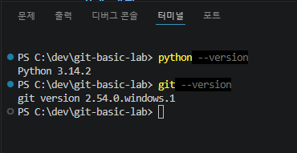
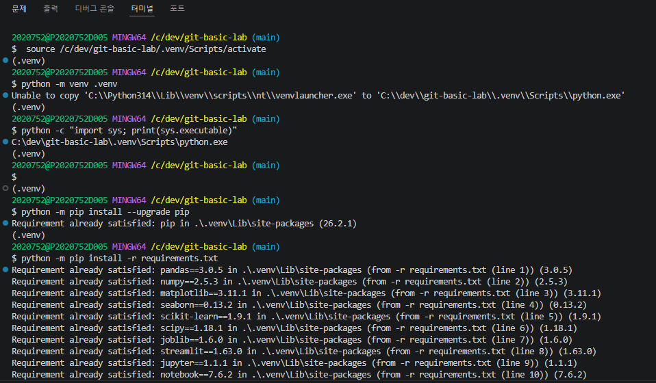
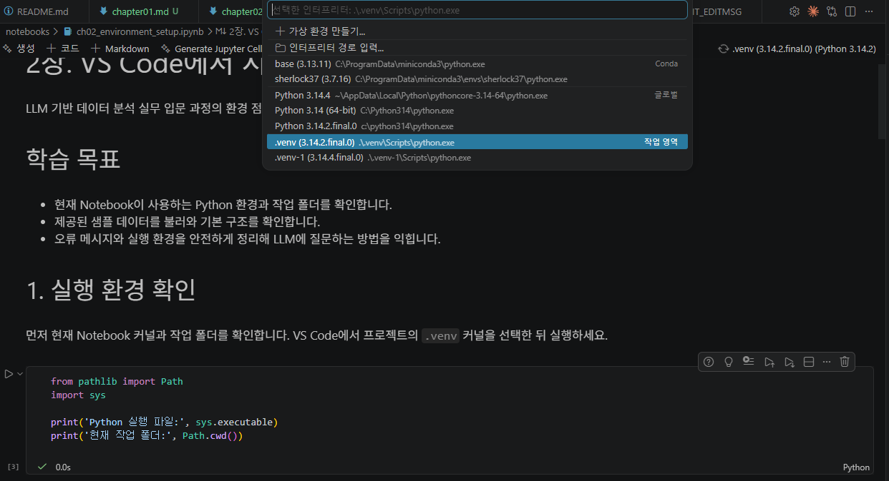
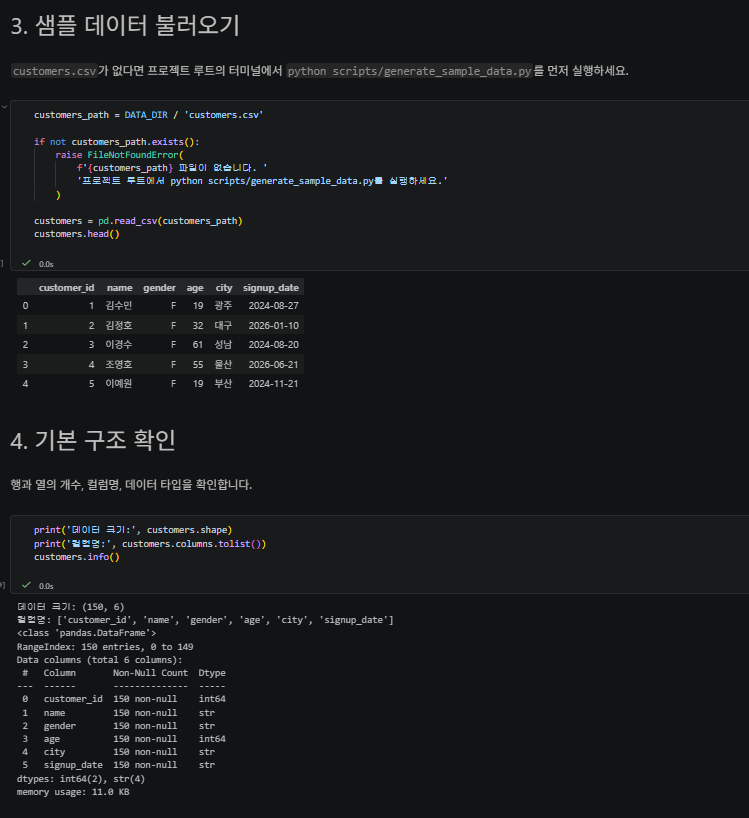
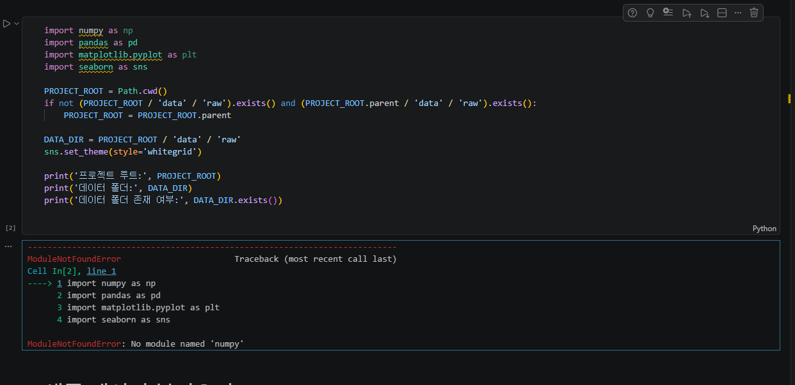
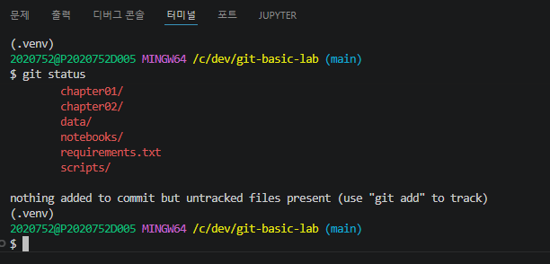

# Chapter 02 제출 답안. VS Code에서 시작하는 데이터 분석 환경

> 최종 파일은 개인 GitHub 저장소의 `chapter02/chapter02.md`로 저장하는 것을 권장합니다.

## 0. 제출 정보

- 이름: 장태진
- GitHub ID: Taejin-AI
- 개인 저장소: `llm-data-analysis-study`
- 작성일: 2026.09.17
- 운영체제: Windows 10

### 최종 제출 URL

```text
https://github.com/Taejin-AI/llm-data-analysis-study/blob/master/chapter02/chapter02.md
```

---

## 1. Python과 Git 환경 확인

### 실행 내용

```text
python --version
git --version
```

### 실행 결과

```text
$ python --version
Python 3.14.2

$ git --version
git version 2.54.0.windows.1
```

### Evidence



### 결과 관찰

터미널 입력 결과 Python은 3.14.2, Git은 2.54.0으로 두 명령 모두 별도 설치 과정 없이 바로 버전이 출력되었습니다.

### 나의 해석과 판단

Python과 Git 모두 최신 버전이라는 점을 알 수 있었습니다. 버전에 따라 수업 실습에 문제가 생길 수 있으니 
버전 관리를 잘해야 된다고 생각했습니다. 우선 실습 환경 조건이 충족된 것 같습니다. 


### 업무·분석적 의미

버전 확인은 사소해 보이지만, 팀원 간 도구 버전이 다르면 같은 코드가 한쪽에서만 동작하는 문제가 생길 수 있다고 생각합니다. 
프로젝트 협업 시 버전을 기록하고 공유하는 것이 중요하다는 생각이 들었습니다.

### 한계와 추가 확인 사항

컴퓨터에 매번 Python을 다른 버전으로 지웠다가 까는 것이 번거롭다는 한계가 있을 것 같습니다. 
가상 환경 `.venv`가 이러한 문제를 해결해줄 수 있다고 들어서 알고는 있었는데, 실제 확인해보고 싶습니다. 
---

## 2. 저장소와 `.venv` 준비

### 수행 내용

- [x] 공식 Public 저장소 확인 (`GilbertMoon/llm-data-analysis-course`)에서 `requirements.txt`, `scripts/generate_sample_data.py`, `notebooks/ch02_environment_setup.ipynb`를 내 프로젝트 저장소(`git-basic-lab`)로 가져옴
- [x] 프로젝트 루트 확인
- [x] `.venv` 생성
- [x] `.venv` 활성화 및 실제 Python 경로 확인
- [x] `requirements.txt` 설치

### 핵심 실행 결과

```text
1. 현재 프로젝트 경로: C:\dev\git-basic-lab
2. 가상환경 생성 명령: C:\Python314\python.exe -m venv .venv
3. 터미널 Python 실행 파일: C:\dev\git-basic-lab\.venv\Scripts\python.exe
4. 가상환경 활성화 여부: 정상 
5. 패키지 설치 결과: pip 26.2.1, requirements.txt의 패키지 다수 설치됨
```

### Evidence




### 결과 관찰

`.venv` 생성 후 `python -c "import sys; print(sys.executable)"`를 실행하면 `C:\dev\git-basic-lab\.venv\Scripts\python.exe`가 출력됩니다. 기존 Python 경로(`C:\Python314\python.exe`)와 다릅니다. `pip install -r requirements.txt`는 오류 없이 모두 설치되었습니다.

### 나의 해석과 판단

터미널에 `(.venv)`라는 프롬프트 표시만 보고 넘어가면 실제로 어떤 Python이 실행되는지는 알 수 없습니다. 그러나 `sys.executable`로 경로를 확인하면 "이 프로젝트만의 독립된 Python"이라는 것을 알 수 있습니다. 경로가 다른 것을 보았을 때 서로 다른 환경이라는 것도 유추할 수 있었습니다.

### 업무·분석적 의미

프로젝트마다 `.venv`를 분리하면, 다른 프로젝트의 패키지와 충돌이 없을 것 같습니다. 그리고 이 프로젝트의 `requirements.txt`로 동일한 환경을 다른 PC에서도 재현할 수 있을 것 같습니다. 협업 시 아주 유용할 것 같습니다.

### 한계와 추가 확인 사항

`requirements.txt`의 경우 운영체제나 Python 버전이 다른 환경에서는 동일 버전이 설치되지 않을 수 있다는 점을 들어서 알고 있는데, 
가능하다면 추가 확인해보고 싶습니다.

---

## 3. VS Code 인터프리터와 Jupyter 커널 연결

### 확인 결과

```text
VS Code Python 인터프리터: .venv (C:\dev\git-basic-lab\.venv\Scripts\python.exe)
Notebook sys.executable: C:\dev\git-basic-lab\.venv\Scripts\python.exe
Notebook Path.cwd(): C:\dev\git-basic-lab\notebooks
```

### Evidence



### 결과 관찰

Notebook을 `git-basic-lab-venv` 커널로 실행하였습니다. `sys.executable`은 `.venv\Scripts\python.exe`와 일치했고, `Path.cwd()`는 `notebooks` 폴더였습니다. 처음에는 커널을 명시적으로 지정하지 않고 실행했더니 (`C:\Python314`)에 연결된 것으로 보아 이것이 기본 커널인 것 같습니다.

### 나의 해석과 판단

터미널에서 확인한 `.venv` 경로와 Notebook에서 확인한 `sys.executable`이 문자 그대로 동일하므로, 터미널 Python과 Notebook Kernel이 같은 가상환경을 쓰고 있다고 생각했습니다. 반대로 이번에 처음 실행이 실패했을 때는 두 값이 서로 달랐고, 그것이 바로 `ModuleNotFoundError`의 원인이었습니다.

### 업무·분석적 의미

Python Interpreter 설정과 Jupyter의 Kernel 설정은 별개여서, 인터프리터만 `.venv`로 바꾸고 Notebook 커널은 그대로 두면 `pip install`한 패키지가 Notebook에서는 안 보이는 상황이 생길 수 있습니다. 두 설정을 각각 확인하는 습관이 디버깅 시간을 줄여준다고 느꼈습니다.

### 한계와 추가 확인 사항

VS Code Notebook 커널 드롭다운에는 `.venv` 외에도 conda 환경(`base`, `sherlock37`)과 여러 시스템 Python이 함께 나열되어 있었습니다. 이름만 보고 고르면 헷갈리기 쉬워서, 반드시 경로(`sys.executable`)로 최종 확인하는 습관이 필요하다고 느꼈습니다.

---

## 4. 샘플 데이터와 Notebook 실행 검증

### 확인 결과

```text
DATA_DIR 존재 여부: True (C:\dev\git-basic-lab\data\raw)
customers.csv 존재 여부: True
customers.shape: (150, 6)
주요 컬럼: ['customer_id', 'name', 'gender', 'age', 'city', 'signup_date']
```

### Evidence




### 결과 관찰

프로젝트 루트에서 `python scripts/generate_sample_data.py`를 실행하자 `data/raw/customers.csv`, `products.csv`(100행), `orders.csv`(300행), `order_items.csv`(764행)가 생성되었다. Notebook에서 `customers.csv`를 `pd.read_csv`로 불러온 결과 `customers.head()`가 오류 없이 출력되었고, `customers.shape`는 `(150, 6)`, `customers.columns`는 `customer_id, name, gender, age, city, signup_date` 6개 컬럼으로 확인되었다. `customers.info()`에서도 6개 컬럼 모두 결측치(Non-Null Count) 없이 150행이 채워져 있었다.

### 나의 해석과 판단

이 단계까지 오류 없이 실행되었다면 (1) `.venv`에 패키지가 정상 설치되어 있고, (2) Notebook 커널이 그 `.venv`를 정확히 바라보고 있으며, (3) 샘플 데이터 생성 스크립트와 Notebook의 상대 경로 처리(`DATA_DIR`)가 서로 맞아떨어진다고 볼 수 있겠습니다.

### 업무·분석적 의미

본격적인 EDA나 분석 코드를 작성하기 전에, "환경이 데이터를 정상적으로 읽어올 수 있는가"를 확인하는 최소한의 테스트인 것 같습니다. 
이 단계를 건너뛰고 바로 복잡한 분석 코드를 짜면, 문제가 생겼을 때 원인이 코드 로직인지 환경 설정인지 구분하기 어려워집니다.

### 한계와 추가 확인 사항

현재는 파일이 정상적으로 로드되고 컬럼 구조가 예상과 같다는 것만 확인했고, `age`나 `signup_date` 같은 값의 이상치·형식 오류 같은 데이터 품질 자체는 아직 검증하지 않습니다. 이 부분은 추후 학습하며 보완할 예정입니다.

---

## 5. 오류 해결 기록

### 오류 메시지

```text
ModuleNotFoundError: No module named 'numpy'
(ch02_environment_setup.ipynb 실행 중, 두 번째 코드 셀에서 발생)
```

### 원인 후보

1. `.venv`에 numpy/pandas 등이 실제로 설치되지 않았을 가능성
2. Notebook이 `.venv`가 아닌 다른 Python(시스템 Python 등)에 연결된 Jupyter 커널을 사용하고 있을 가능성

### 내가 확인한 순서

1. `.\.venv\Scripts\python.exe -m pip list`로 `.venv` 안에 numpy/pandas가 실제로 설치되어 있는지 확인 → 정상 설치되어 있음. 1번 후보는 배제
2. `.\.venv\Scripts\python.exe -m jupyter kernelspec list`로 현재 등록된 Jupyter 커널 목록을 확인 → `python3`라는 커널 하나만 있었고, 그 경로가 `.venv`가 아니라 시스템 Python(`C:\Python314\share\jupyter\kernels\python3`)을 가리키고 있음을 확인하였습니다.


### 해결 방법

```text
.venv 안에서 ipykernel로 이 가상환경 전용 커널을 새로 등록함:

.\.venv\Scripts\python.exe -m ipykernel install --user --name=git-basic-lab-venv \
    --display-name "Python (git-basic-lab .venv)"

이후 Notebook 실행 시 이 커널("Python (git-basic-lab .venv)")을 선택하여 재실행하니
numpy/pandas import 및 이후 셀이 모두 정상적으로 실행되었습니다.
```

### Evidence




### 나의 해석과 판단

`.venv` 안에 패키지가 이미 설치되어 있는데도 `ModuleNotFoundError`가 났다는 것은 문제가 "패키지 설치"가 아니라 "어떤 Python을 실행 중인가"에 있다는 신호였습니다. `jupyter kernelspec list`로 커널이 가리키는 실제 경로를 확인하여 원인을 좁힐 수 있었습니다. 이번 과제에서 강조하는 "터미널 Python = VS Code Interpreter = Jupyter Kernel"이 실제로 어긋날 수 있고, 그 어긋남이 바로 이런 형태의 오류로 나타난다는 것을 알았습니다.

### 한계와 추가 확인 사항

이번에는 원인이 명확해서 커널을 새로 등록하는 것으로 해결했지만, 만약 이 방법으로도 안 됐다면 `.venv` 폴더 자체를 지우고 다시 만드는 등 더 큰 조치를 시도했을 것입니다. 원인을 확인하지 않은 상태에서 무작정 가상환경을 삭제하거나 시스템 Python 정책을 바꾸는 것은 좋지 않을 것 같습니다.

---

## 6. Secret 보호 확인

- [x] `.env`는 Git 추적 대상이 아닙니다. (`.gitignore`에 `.env` 등록, 프로젝트에 `.env` 파일 자체가 존재하지 않음)
- [x] 실제 API Key를 코드에 작성하지 않았습니다. (`requirements.txt`에 `google-genai`가 포함되어 있지만 이번 실습에서는 API Key를 사용하는 코드를 실행하지 않음)
- [x] 캡처 화면에 Token/비밀번호가 없습니다.
- [x] `.venv`를 Git에 올리지 않습니다. (`.gitignore`에 `.venv/` 등록)

### Evidence




### 나의 해석과 판단

`.venv`에는 다수의 패키지 파일이 들어있어 Git에 올리면 저장소 용량만 커지고 재현에도 도움이 되지 않으므로, `requirements.txt`만 커밋하고 `.venv`는 각자 로컬에서 새로 만드는 것이 맞다고 판단했다. `.env`는 아직 실습에서 실제로 만들지 않았지만, API Key를 쓰게 될 이후 챕터를 대비해 미리 `.gitignore`에 등록해두었다. `customers.csv` 등 샘플 데이터는 Faker로 생성한 가상 인물 정보이므로 실제 개인정보에는 해당하지 않지만, 실제 서비스 데이터를 다룰 때는 이 파일들도 공개 저장소에 올려도 되는지 별도로 검토해야 한다고 생각한다.

---

## 7. Chapter 02 최종 회고

### 가장 중요했다고 생각한 환경 설정 1가지

```text
Notebook이 사용하는 Jupyter 커널을 .venv에 맞게 별도로 등록한 것이 가장 중요했다고 생각합니다. 
.venv를 만들고 패키지를 설치하는 것까지는 문제없이 끝났지만,
Notebook 실행 시 커널을 명시하지 않으면 조용히 다른 Python이 선택될 수 있다는
것을 이번에 직접 오류로 경험했기 때문입니다.
```

### 그 이유

```text
터미널에서 pip install이 성공했다는 사실과, Notebook에서 그 패키지를 실제로 사용할 수 있다는 사실은
서로 다른 문제라는 것을 이번 실습에서 배웠습니다. 두 환경이 같은 .venv를 가리키고 있는지를
sys.executable 같은 구체적인 값으로 확인하지 않으면, 겉으로는 설정이 끝난 것처럼 보여도
실제로는 연결이 안 되어 있을 수 있다는 점이 인상 깊었습니다.
```

### 다음 Chapter에서 재사용할 환경 체크 3가지

1. 새 Notebook을 열 때마다 우측 상단 커널 이름이 아니라 `sys.executable` 값으로 `.venv` 연결 여부를 확인한다.
2. 패키지 관련 오류가 나면 먼저 `.venv`의 `pip list`로 설치 여부를, 그다음 `jupyter kernelspec list`로 커널 경로를 확인하는 순서로 디버깅한다.
3. 새로운 프로젝트/챕터를 시작할 때는 `requirements.txt`만 커밋하고 `.venv`, `.env`는 항상 `.gitignore`에 먼저 등록한다.

### 현재 환경의 한계 또는 주의점

```text
이번 검증은 VS Code Notebook에서 직접 인터프리터/커널을 선택하고, 일부러 패키지가 없는
가상환경으로 커널을 바꿔 오류를 재현한 뒤 다시 .venv 커널로 되돌려 해결하는 과정까지
직접 눈으로 확인했습니다. 다만 requirements.txt의 패키지 버전이 최신 고정 버전이라,
다른 PC나 운영체제에서도 동일하게 설치되는지는 아직 확인하지 못했습니다.
```

---

## 최종 제출 체크

- [x] 핵심 Evidence 6장을 첨부했습니다.
- [x] 단순 캡처가 아니라 관찰과 판단을 작성했습니다.
- [x] Secret/개인정보가 없습니다.
- [x] GitHub에서 이미지가 정상 표시됩니다.
- [x] 개인 저장소에 `chapter02/chapter02.md`를 업로드했습니다.
- [x] 저장소 URL이 아니라 최종 파일 URL을 제출합니다.
